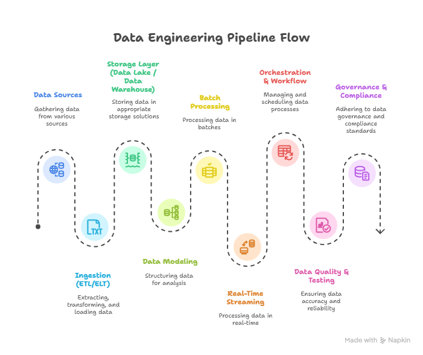
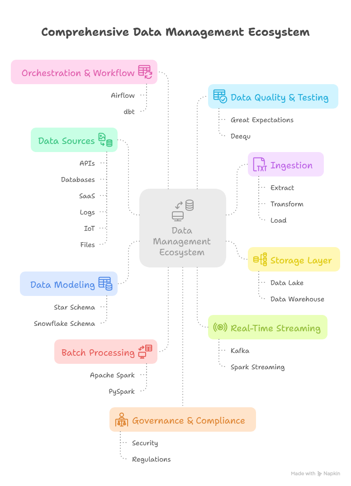

## 💾 Data Engineering Concepts Notes

These notes cover fundamental concepts in data engineering, focusing on database paradigms, data warehousing, dimensional modeling, and big data architecture.

---

## 1. Core Database Systems

A comparison between Online Transactional Processing (**OLTP**) and Online Analytical Processing (**OLAP**).

| Feature | OLTP (Databases) | OLAP (Data Warehouse) |
| :--- | :--- | :--- |
|  **Full Name**  | Online Transactional Processing | Online Analytical Processing (Data Warehouse) |
| **Primary Use** | Handles frequent writes and updates. Optimized for transactional reads. | Optimized for complex analytical reads and aggregations. |
| **Data Management** | Managed by **DBA** using **Normalization** (1NF, 2NF, 3NF). | Managed by Data Engineers/Architects using Dimensional Modeling. |
| **Examples** | MySQL, PostgreSQL, MS SQL, etc. | Snowflake, Amazon Redshift, Google BigQuery, WhereScape RED |

---

## 2. ETL and Data Warehouse Architecture

### Data Engineering Pipeline Flow

A typical data engineering pipeline involves several stages, from data sources to governance.

### ETL Pipeline
The process of moving data to the Data Warehouse (OLAP) is often called **ETL**:
1.  **Extract**
2.  **Transform**
3.  **Load**

**Important Note**: **Don't perform queries on the OLTP DB of the source**; pull the data to a stage first. ETL pipelines are often automatic.

### Data Warehouse Layers
Data is loaded sequentially through layers:
1.  **Staging**: A **Transient (Temporary)** layer. Data is often truncated.
2.  **Core**: Contains the final modeled data, utilizing **Fact, dimension tables** and **Dimensional Modeling**.

### Loading Strategy
* **Incremental Loading**: A preferred strategy. Load the initial full set once, and then only load the increment (new/changed data). This avoids loading all the data every time.

---

## 3. Dimensional Modeling

Dimensional Modeling is key for analytical systems.

### Schemas
1.  **Star Schema**: Simple model with **one dimension to fact**.
2.  **Snowflake Schema**: A more complex structure that involves a **hierarchy of dimensions**.

### Slowly Changing Dimensions (SCD)
SCDs are techniques for handling changes in dimension data over time.

| SCD Type | Description | Change Handling |
| :--- | :--- | :--- |
| **Type-0** | **No Change** | Data remains static. |
| **Type-1** | **Upsert** (Update + Insert) | Overwrites the existing record. History is lost. |
| **Type-2** | **History** | Preserves full history by adding new rows with effective dates. |
| **Type-3** | **Previous Value** | Keeps a column for the previous value (e.g., `prev-cat`). |

---

## 4. Data Management Ecosystem & Storage

The data management ecosystem is comprehensive, integrating various components for end-to-end data processing.

### Data Lake vs. Data Warehouse vs. Lakehouse

| Feature | Data Lake | Data Warehouse |
| :--- | :--- | :--- |
| **Data Capture** | Unstructured, Semi-Structured, and Structured data in its **raw format**. | **Only Structured data**. Data is transformed & cleansed. |
| **Schema Definition** | **Schema-on-Read**: Defined **after** data is stored. | **Schema-on-Write**: Defined **prior** to when data is stored. |
| **Storage Cost** | Low. | High. |
| **Query Performance** | Querying results is time consuming. | Better price & performance querying results. Offers performance, security & integration. |
| **Use Cases** | Big data processing, Analytics, Cloud and IoT, Data Movement. | Reports, BI. |

### Data Lakehouse
The **Lakehouse** architecture combines the best of both worlds.

| Data Warehouse | Data Lake | Data Lakehouse |
| :--- | :--- | :--- |
| Reports, BI | BI Reports, DS, ML | DS, ML, BI Reports |
| ETL | ETL | ETL |
| **Structured Data** | Structured, semi-structured, unstructured data | Structured, semi-structured, unstructured data |
| | | Includes a **Metadata and Governance Layer**. |

---

## 5. File Formats and Delta Lake

### File Formats
Data format selection depends on the workload.

| Type | Examples | Optimization | Structure |
| :--- | :--- | :--- | :--- |
| **Row-based** | CSV, AVRO | Best for **Writes and updates**. | Stores data record-by-record. |
| **Column-based** | **Parquet**, **ORC** | Best for **Reads**. | Stores data column-by-column. |

### Delta Format
The **Delta Format** is a storage layer that adds reliability to data lakes.
* It provides **ACID properties**.
* It uses a **Transaction Log** (stored as a JSON file) to store metadata and track every transaction/operation (delete, upsert).
* This log enables **Versioning** (time travel).

---

## 6. Big Data Ecosystem

### Key Tools
* **Batch Processing**: **Apache Spark**, **PySpark**
* **Real-Time Streaming**: **Kafka**, **Spark Streaming**
* **Orchestration**: **Apache Airflow**, **dbt**
* **Data Quality**: **Great Expectations**, **Deequ**
* **Other Tools**: **Apache Hive**

### Distributed Computing with Spark
* A **Cluster** is a bunch of machines.
* When a task is given to Spark to process data:
    1.  Spark gives the task to the **Driver Node**.
    2.  The Driver Node divides the work across the **Worker Nodes** (machines) .
